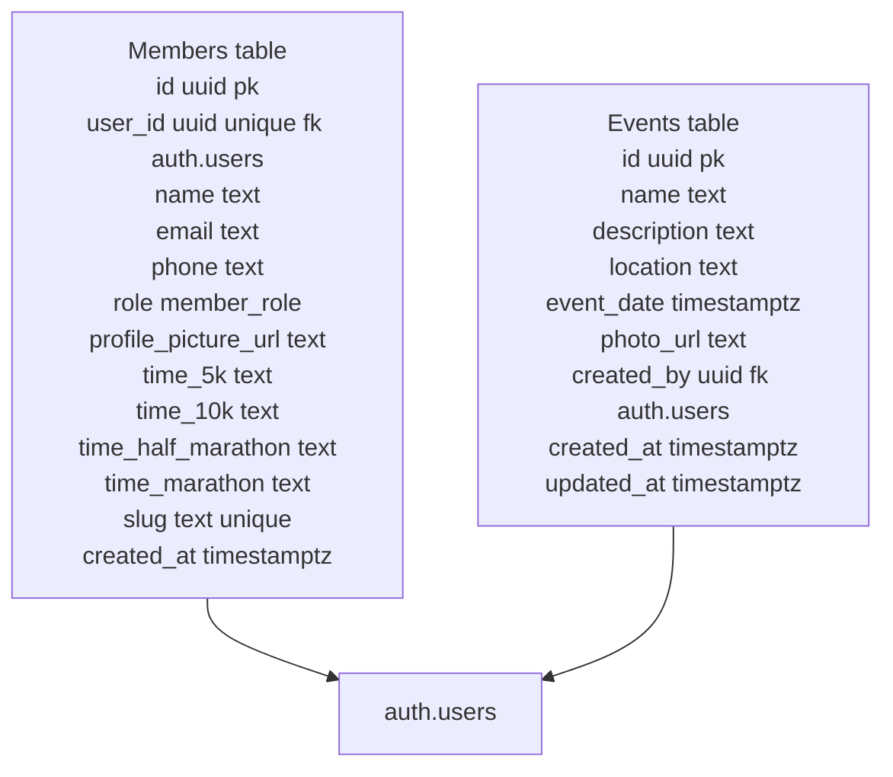

## Supabase context reference

### Client initialization
- File: [src/lib/supabase.ts](src/lib/supabase.ts)
- Uses `createClient` with env vars:
  - `VITE_SUPABASE_URL`
  - `VITE_SUPABASE_PUBLISHABLE_KEY`
- Exposes `getMember(slug: string)` which selects from `members` by `slug` and returns single row (null on error).

### Schemas (from migrations)

#### members table
- Source: [supabase/migrations/20260512012814_create_members_table.sql](supabase/migrations/20260512012814_create_members_table.sql)
- Columns:
  - `id uuid primary key default gen_random_uuid()`
  - `user_id uuid unique references auth.users(id) on delete cascade`
  - `name text not null`
  - `email text`
  - `phone text`
  - `role member_role not null default 'member'` (enum `member_role` with values `admin`, `member`)
  - `profile_picture_url text`
  - `time_5k text`
  - `time_10k text`
  - `time_half_marathon text`
  - `time_marathon text`
  - `created_at timestamptz default now()`

#### members slug support
- Source: [supabase/migrations/20260512020738_add_member_slug.sql](supabase/migrations/20260512020738_add_member_slug.sql)
- Adds `slug text unique` to `members`.
- Functions:
  - `generate_slug(input text)` -> slugifies text via regex replace to lowercase hyphenated.
  - `set_member_slug()` trigger function: sets `new.slug` to `generate_slug(new.name)` when absent.
- Trigger:
  - `trigger_set_member_slug` BEFORE INSERT on `members` executes `set_member_slug()`.

#### members RLS and policies
- Sources:
  - [supabase/migrations/20260512013911_create_members_rls_policies.sql](supabase/migrations/20260512013911_create_members_rls_policies.sql)
  - RLS enabled on `members` (also re-enabled in slug migration).
- Helper function:
  - `is_admin()` (security definer, search_path public) checks `members` where `user_id = auth.uid()` and `role = 'admin'`.
- Policies:
  - "Public can view members" – `select` using `(true)`.
  - "Users can update own profile or admins" – `update` using `auth.uid() = user_id OR is_admin()`.
  - "Admins can insert members" – `insert` with check `is_admin()`.
  - "Admins can delete members" – `delete` using `is_admin()`.

#### events table
- Source: [supabase/migrations/20260512013625_create_events_table.sql](supabase/migrations/20260512013625_create_events_table.sql)
- Columns:
  - `id uuid primary key default gen_random_uuid()`
  - `name text not null`
  - `description text`
  - `location text`
  - `event_date timestamptz not null`
  - `photo_url text`
  - `created_by uuid references auth.users(id)`
  - `created_at timestamptz default now()`
  - `updated_at timestamptz default now()`
- Note: later migration [supabase/migrations/20260512015826_add_new_fields_to_events.sql](supabase/migrations/20260512015826_add_new_fields_to_events.sql) adds `created_by` and `updated_at` (already present in earlier file — verify order if consolidating).

#### events RLS and policies
- Source: [supabase/migrations/20260512013949_create_events_rls_policies.sql](supabase/migrations/20260512013949_create_events_rls_policies.sql)
- RLS enabled on `events`.
- Policies (all rely on `is_admin()`):
  - "Public can view events" – `select` using `(true)`.
  - "Admins can insert events" – `insert` with check `is_admin()`.
  - "Admins can update events" – `update` using `is_admin()`.
  - "Admins can delete events" – `delete` using `is_admin()`.

### Supabase config references
- Config file: [supabase/config.toml](supabase/config.toml)
- Local ports: API 54321, DB 54322, Studio 54323, Realtime enabled, Auth enabled, Storage enabled.
- Seed path: `supabase/seed.sql` (present in config; file not reviewed here).

### Schema diagram (Supabase)

### Frontend usage note
- Current frontend still uses static members data in [src/assets/data/members.ts](src/assets/data/members.ts) and types in [src/types/members.ts](src/types/members.ts); migration schema diverges (uuid id, role enum, slug, times, profile_picture_url). Align types and fetch logic before integrating live Supabase data.

### Suggested next steps
- Add service methods for events (list/read) and members (list/read by slug) with proper typing.
- Align frontend `Member` type with DB schema and use `slug` routing instead of numeric id.
- Add environment variable docs for local `.env` with `VITE_SUPABASE_URL` and `VITE_SUPABASE_PUBLISHABLE_KEY`.
